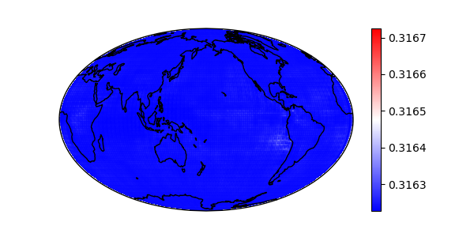

# CNN ESM Emulator

Official code repository for the paper: [Toward efficient calibration of higher-resolution Earth System Models](https://www.climatechange.ai/papers/icml2021/51), 
presented at the ICML 2021 Workshop on Tackling Climate Change with Machine Learning.

Originally implemented using TensorFlow 2.4. New PyTorch implementation also provided.

## Setup
1. [Install Anaconda or Miniconda](https://docs.conda.io/projects/conda/en/latest/user-guide/install/index.html)
2. Create a new conda environment with Python 3.8: ```$ conda create -n cnn-esm python==3.8```. 
3. Activate the environment: ```$ conda activate cnn-esm```
4. Clone this repo: ```$ git clone https://github.com/Fletcher-Climate-Group/cnn-esm-emulator.git```
5. Install the dependencies: ```$ cd cnn-esm-emulator && pip install -r requirements.txt```
6. Optionally follow steps to setup [TensorFlow for GPU](https://www.tensorflow.org/install/gpu)
7. Install the cartopy package via conda for plotting: ```$ conda install -c conda-forge cartopy```
8. Download and extract the preprocessed ESM data:  ```$ sh download_data.sh```


## TensorFlow
### Training (high-resolution)
Run ```$ python tf/train.py``` to train the model below on the high-resolution (f09) data using the default settings. 
The experiment will be saved under ```experiments/tf/single-res```.


Sample test predictions from the trained model are shown below:

| Output  | Prediction | Ground-Truth |
| --- | --- | --- |
| AOD  |  |  |
| CLDL |  |  |
| FNET |  |  |
| LWCF |  |  |
| PRECT |  |  |
| QRL |  |  |
| SWCF |  |  |

### Training (multi-resolution)
**GPU(s) required.**
In this experiment, the model depicted above is trained using the low resolution (f45 and f19) ESM data, 
and ```n_hr``` samples from the high resolution (f09) ESM. 
The low resolution maps are upsampled to the high resolution size.
An extra input feature is used, representing the resolution of the input samples 
(```1``` for f45, ```1/4``` for f19, and ```1/16``` for f09). 

In the paper, ```n_hr``` was varied from 0 to 40 and 40 random trials were run at each value of ```n_hr```. Run ```train_multi_res.py```
using the default arguments to replicate the paper results. 
Training a single model on a TITAN Xp GPU takes approximately 120 seconds. 
The full experiment trains 600 models, and therefore requires ~1 GPU day.

A shorter demo experiment (~0.5 GPU hours) can be run using the following command:<br />
```$ train_multi_res.py --n-hr 0 20 40 --n-trials 4 --n-gpu 2 --save-models```

The experiment will be saved under ```experiments/tf/multi-res```. 
Plots of the mean errors for each value of ```n_hr```:

| Output | ```n_hr = 0``` | ```n_hr = 20``` | ```n_hr = 40``` |
| --- | --- | --- | --- |
| FNET |  |  |  |
| PRECT |   |  |  |

The feature importance scores are produced by shuffling each input feature and evaluating the loss in skill score as a result. 
Here are the feature importance scores at ```n_hr = 40```:


## PyTorch (Probabilistic Model)
**Warning:** This section is experimental and is under active development.
### Training (high-resolution)
Replication of the high-res TensorFlow experiment. Run ```$ python pt/train.py --name f09 --predict``` to train the model below on the high-resolution (f09) data using the default settings. 
The experiment will be saved under ```experiments/pt/single-res```.

For the probabilistic model:  `$ python pt/train.py --name f09-prob --prob --predict`

Sample probabilistic predictions shown with mean and standard deviation below:

| Output | Ground-Truth  | Mean Prediction | Standard Deviation Prediction |
| --- | --- | --- | --- |
| AOD  |  |  |  |
| CLDL |  |  |  |
| FNET |  |  |  |
| LWCF |  |  |  |
| PRECT |  |  |  |
| QRL |  |  |  |
| SWCF |  |  |  |


